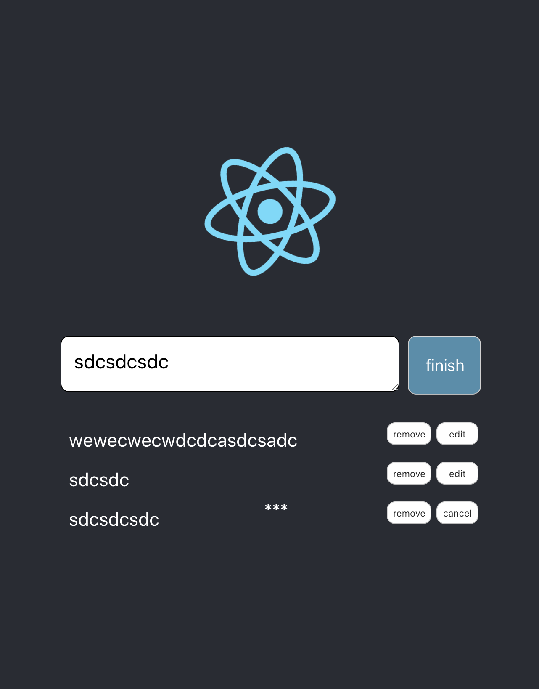

# Simple React Notice

Custom for P'ลูกหมู



## Structure

Using `createRef` from `import React, { createRef } from 'react'` to change state between component. It's not like emit event to self component and with forparent to see but it's find the right component, get it and execute inner function with out saying anything to another component.

suggest to not store `createRef` value to react state but use globally instant.

```
this.ref_myselect = createRef();
this.state = {...}
```

bound with component

```
<MyComponent ref={this.ref_myselect} />
```

execute in javascript

```
func() {
  this.ref_myselect.current.METHOD(...);
}

type this.ref_myselect = React.RefObject<>
type this.ref_myselect = React.RefObject<>.current (use this)
```

## Addition knowledge

use `props` when you need some thing reactive from parent.
use `state` when you initialize something and not care what every that parent's value change or not.

so that is why in `constructure()` have no props.
